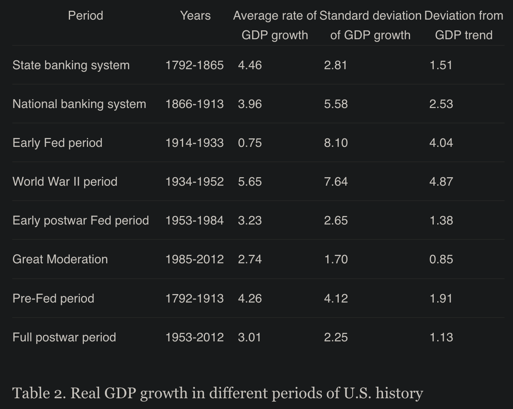

The introduction of the Federal Reserve in the US in 1913 marked a turning point in US and global economics, followed by the abondance of the gold standard by the Fed in 1933. 

<<<<<<< Updated upstream
I want to share my learnings from a study published by [Thomas. L. Hogan](https://x.com/HoganMonEcon) in 2014 about the impact of the Federal Reserve on the US economices: 

_[Has the Fed Improved U.S. Economic Performance?](https://papers.ssrn.com/sol3/papers.cfm?abstract_id=2356639)_
=======
I want to share my learnings from a study* published by [Thomas. L. Hogan](https://x.com/HoganMonEcon) in 2014 about the impact of the Federal Reserve on the US economices: 

> [Has the Fed Improved U.S. Economic Performance?](https://papers.ssrn.com/sol3/papers.cfm?abstract_id=2356639)
>>>>>>> Stashed changes

<!--more-->

## Quote Of The Day

> Freedom is the freedom to say that two plus two make four. If that is granted, all else follows.

## Inflation Rates Increased

The average rate of inflation was only 1% in the state banking period and was actually slightly negative at -1% in the national banking period. Average inflation rose to 1.89% in the early Fed period, then 3.93% in the World War II period and as high as 4.41% in the early postwar Fed period.

## Volatility of Inflation Dropped

The overall volatility of inflation in the pre-Fed periods is 5.96 percent, while the standard deviation in the full postwar period is 2.82 percent.

## High Inflation in the Early Days

The WWII period and early postwar period after the FED introduction drive the high inflation rates during the full postwar period. However, inflation rates have higher in the other two periods still range ~2.26% above the pre-FED inflation rates.

## GDP Growth Dropped

GDP in the state banking and national banking periods grew at 4.53 and 3.88%, respectively. The early postwar Fed is slightly lower at 3.23%, and the Great Moderation at 2.74% is more than a full percentage point lower than the pre-Fed periods. The average rate of 4.26 in the full pre-Fed period is also more than a full percentage point higher than the average rate of 3.01 percent in the full post-World War II period.

## Volatility of GDP Growth Dropped

For the full pre-Fed and postwar periods, we see the standard deviation of 2.25 percent in the post-World War II period is lower than the standard deviation of 4.12 percent in the pre-Fed periods. These results indicate that the volatility of GDP growth did improve following World War II, but most of this reduction came during the Great Moderation (1985-2012).

## High Volatility During WWI and WWII

Interestingly, the average GDP growth rate of 5.65 during the World War II period from 1934 to 1952 is higher than in any other period. However, this may be artificially high, since this period begins in 1934, the lowest point of the Great Depression, the recovery from which generated abnormally high rates of growth.

## Conclusions

As seen, the 30 years after 1913 were marked by political instability. One could argue that including this data in the analysis may render it unrepresentative. However, data from the post-war period suggests that similar results apply, albeit with lower significance.

What's the final conclusion? Is a lower rate of GDP growth volatility better if it requires a higher rate of inflation or a lower long-run rate of GDP growth?

The Fed's overall performance is difficult to evaluate because of the tradeoffs between these different aspects of economic performance. Also it is unclear, whether the Great Moderation was caused by factors other than Fed policy.

Might a decentralized, not discontinued gold-backed monetary standard during the 20th century could have created even greater economic performance than was witnessed during the 19th century?

It would be interesting to reassess this study by incorporating data from 2012 to the present, as this could potentially lead to different results.
